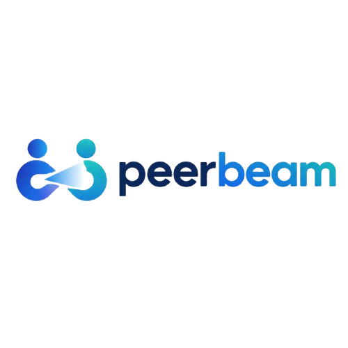
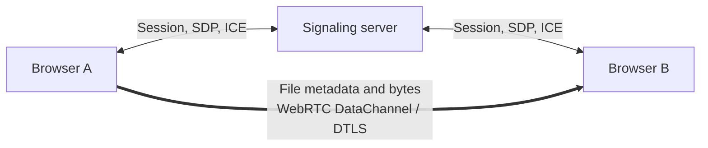

# PeerBeam

**Inspectable browser-to-browser file transfers over WebRTC.**

[](https://github.com/hoowertsg19/PeerBeam/actions/workflows/ci.yml)
[](LICENSE)
[](package.json)

PeerBeam sends one file directly between two browsers. A small WebSocket server introduces the peers and relays SDP/ICE; file metadata and bytes use an ordered, reliable WebRTC DataChannel.

## Why PeerBeam?

PeerBeam keeps its control plane separate from its data plane. It requires no accounts, asks the receiver for explicit consent, and exposes live ICE, PeerConnection, DataChannel, candidate, and byte diagnostics. The codebase is deliberately small enough to inspect: React and TypeScript in the browser, Node.js and WebSocket for signaling, and strict Zod schemas at protocol boundaries.

It does not provide anonymity, verified peer identity, custom end-to-end encryption, or universal network reachability.

## logo



## Features

- Direct WebRTC file transfer between two browsers, with explicit receiver consent.
- One active file up to 128 MiB, read progressively in bounded chunks.
- Backpressure, progress, average speed, cancellation, and receiver acknowledgement.
- Download-only reception with sanitized filenames and no automatic previews.
- Visible connection diagnostics and nonfatal signaling loss after the P2P channel opens.
- English/Spanish language selection and persistent day/night themes.
- Temporary eight-character session invitations with bounded lifetime and join attempts.

## How it works



1. Browser A creates a temporary session code; Browser B joins it.
2. The signaling server relays validated session, SDP, and ICE messages.
3. The browsers establish a WebRTC DataChannel. Signaling may then disappear without ending that established channel.
4. A file offer shows its name and size; no payload is read or sent until Browser B accepts.
5. Browser A sends chunks directly to Browser B, which validates them, creates a download, and acknowledges completion.

The signaling server has no file-message endpoint and receives no file metadata or payload through the PeerBeam protocol. Optional STUN discovers network addresses; v0.1 has no TURN relay fallback.

## Quick start

Prerequisites: Node.js **22.14 or newer**, npm, and a current browser with WebRTC support.

```sh
git clone https://github.com/hoowertsg19/PeerBeam.git
cd PeerBeam
npm ci
npm run dev
```

`npm run dev` starts both services:

- Web app: <http://localhost:5173>
- Signaling: `ws://127.0.0.1:8080`

No `.env` file is required for local use. To change ports, origins, signaling, STUN, or session lifetimes, copy `.env.example` to `.env` at the repository root and restart the processes. `VITE_` values are public and embedded in the browser build.

Open the web app in two browser contexts. Choose **Create session** in one, choose **Join session** in the other, enter the eight-character code, and wait for both to show **Peer connected**.

For two physical devices, use trusted HTTPS/WSS and reachable addresses; `localhost` on a phone refers to the phone. Some NAT and enterprise networks cannot connect without TURN.

## Testing

```sh
npm run lint          # ESLint
npm run format:check  # Prettier verification
npm run typecheck     # TypeScript strict checking
npm run test          # Unit and integration tests
npm run build         # Production builds
npx playwright install chromium
npm run test:e2e      # Two real Chromium contexts and WebRTC DataChannel
```

The E2E suite transfers a synthetic file, compares the downloaded bytes exactly, and verifies that an active transfer survives signaling shutdown. See [the validation guide](docs/TESTING.md).

## Architecture

```text
apps/web/                  React/Vite UI, connection manager, transfer state machine
apps/signaling-server/     Temporary sessions and validated SDP/ICE relay
packages/protocol/         Strict Zod wire schemas and inferred types
packages/shared/           Shared session-code rules
e2e/                       Real-browser Playwright coverage
```

Read [the architecture decision](docs/adr/0001-peer-to-peer-architecture.md) and [protocol specification](docs/PROTOCOL.md) before changing transport behavior.

## Security & privacy

WebRTC DataChannels use browser-provided DTLS encryption. The signaling operator still sees connection IPs, session membership, codes, SDP, and ICE network metadata. Origin checks are browser policy, not authentication, and anyone with a live code can join first. Share codes privately and accept only expected files.

Current server controls include 32 KiB signaling messages, five failed joins per connection per 60 seconds, 500 sessions, 1,000 sockets, a 10-minute waiting lifetime, and a 60-minute absolute session/socket lifetime. These limits mitigate basic abuse; they do not provide DDoS protection. Read [SECURITY.md](SECURITY.md) for the complete trust model and private reporting guidance.

## Project status

PeerBeam is early **v0.1** software and is not presented as production-ready or security-audited. It supports one in-memory file at a time, up to 128 MiB. It has no content hash, resume support, folder transfer, persistence, TURN, or multi-peer sessions.

## Roadmap

Planned work is tracked in [GitHub Issues](https://github.com/hoowertsg19/PeerBeam/issues). Protocol and security changes should be discussed before implementation.

## Contributing

External contributions are welcome. [CONTRIBUTING.md](CONTRIBUTING.md) covers setup, architecture, checks, branch and commit conventions, and pull requests. Please follow the [Code of Conduct](CODE_OF_CONDUCT.md).

## License

[MIT](LICENSE) © PeerBeam contributors.
